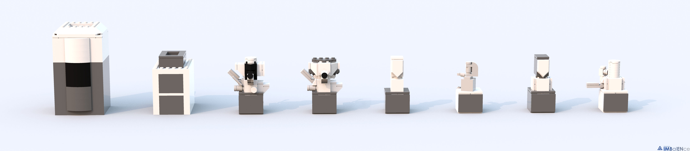
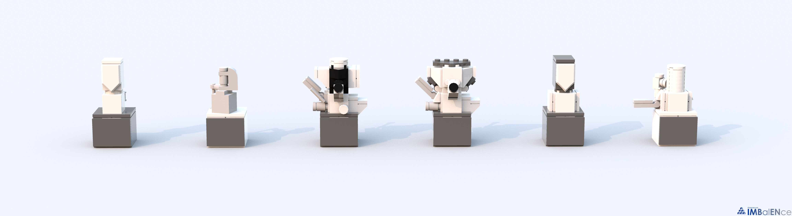
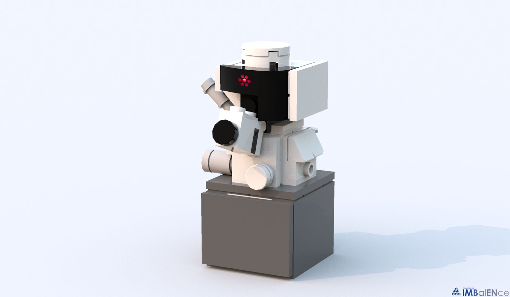
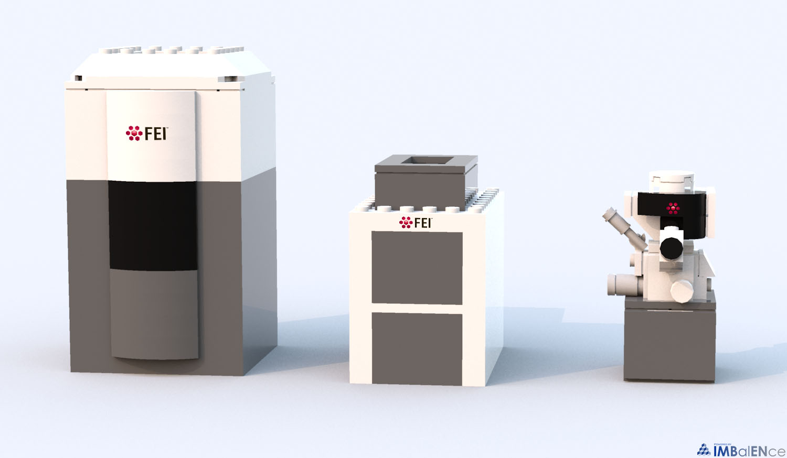

# Lego-Electron-Microscope-Fleet
 A fleet of miniaturized electron microscope LEGO models based on FEI TEMs and SEMs
 
 The .lxf files was designed in LEGO digital designer software. Output images were rendered with Bluerender. 

